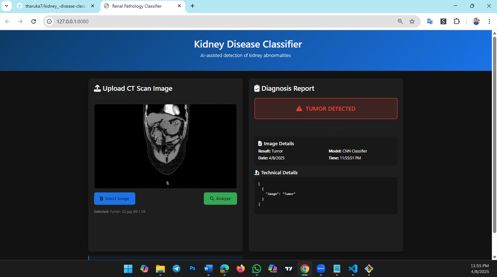

# Kidney-Disease-Classification-MLflow 🩺


## Workflows

1. Update config.yaml
2. Update secrets.yaml [Optional]
3. Update params.yaml
4. Update the entity
5. Update the configuration manager in src config
6. Update the components
7. Update the pipeline 
8. Update the main.py
9. Update the dvc.yaml
10. app.py

# How to run?
### STEPS:

Clone the repository

```bash
https://github.com/tharuka7/Kidney-Disease-Classification-Deep-Learning-Project
```
### STEP 01- Create a conda environment after opening the repository

```bash
conda create -n cnncls python=3.8 -y
```

```bash
conda activate cnncls
```


### STEP 02- install the requirements
```bash
pip install -r requirements.txt
```

```bash
# Finally run the following command
python app.py
```

Now,
```bash
open up you local host and port
```


## Web Application Preview

AI-powered diagnostic system for detecting kidney abnormalities from CT scans using Deep Learning and MLflow.


<div align="center">
  
  <br>
  <em>Normal Kidney Diagnosis Preview</em>
</div>

<div align="center" style="margin-top: 30px;">
  
  <br>
  <em>Tumor Detection Preview</em>
</div>


